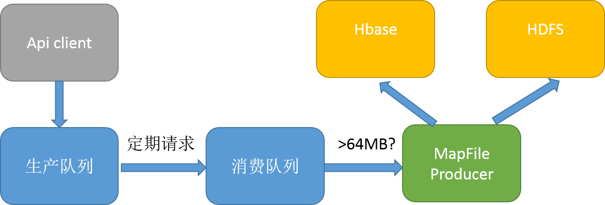
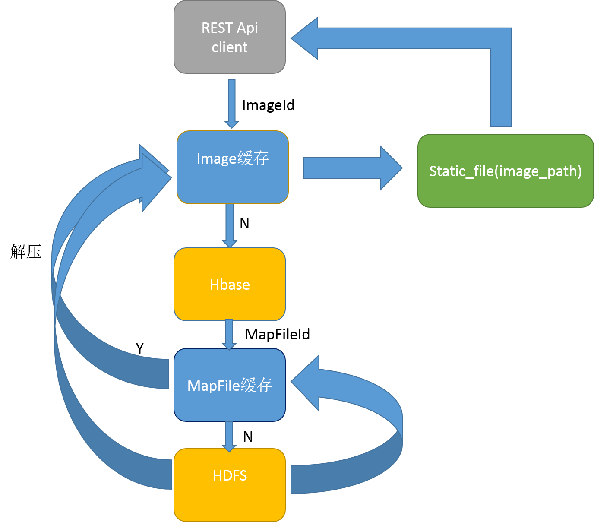

# ImageServer 
分布式图片服务器，基于HDFS/HBASE等
按照实现思路，共有3种实现，分别对应3个分支，master，v2，v3
# 版本一
1. 参考博客[hadoop+hbase海量图片存储](http://blog.csdn.net/good_mpj/article/details/43309553?ref=myread)
2. 图片以MapFile形式存储于HDFS中
3. 构建MapFile生成队列，当队列达到阈值后，构建MapFile,写入HDFS中
4. 队列使用Redis，元数据存储于Redis，图像数据暂存于localFileSystem
5. 构建MapFileId与图片Id之间的对应关系，此K-V键值对存储于HBase/Redis

## server
### 依赖
*centos*

`sudo yum install python python-pip python-devel gcc libffi-devel  openssl-devel`

*ubuntu*

`sudo apt-get install python python-pip build-essential libssl-dev libffi-dev python-dev`

[Hadoop MapFile python api](https://github.com/sixiong/Hadoop) 

`git clone https://github.com/sixiong/Hadoop.git && cd Hadoop/python-hadoop && sudo python setup.py install`

[Hadoopy](http://www.hadoopy.com/en/latest/tutorial.html)

`sudo pip install -e git+https://github.com/bwhite/hadoopy#egg=hadoopy`

Hadoopy依赖Hadoop的shell client,下载Hadoop安装包解压，添加环境变量即可

其它
```bash
cd server && sudo pip install -r requirements.txt
```

### 说明

1. 队列监测端，常驻内存服务，队列满启动创造MapFile写Hdfs流程
2. 安装:`cd server && sudo python install.py`
3. 运行：`nohup python server.py > server.log &`
4. REST API(only GET): `nohup python api.py > api.log &`

## client
1. 写入图片到server的预备队列，支持批量写入
2. 安装:`cd client && sudo pip install -r requirements.txt`
3. 运行:`python client.py "~/Picetures"` or `python client.py "~/Picetures/frame10.jpg"`

## 写入数据流


## 读取数据流


## 读写性能测试
#### apache benchmark(ab)
usage:ab -c 1000 -n 1000000 http://127.0.0.1:82/api/image/Video_8582-frame800.jpg
```
Server Software:        nginx/1.10.2
Server Hostname:        127.0.0.1
Server Port:            82

Document Path:          /api/image/Video_8582-frame800.jpg
Document Length:        6070 bytes

Concurrency Level:      1000
Time taken for tests:   84.395 seconds
Complete requests:      1000000
Failed requests:        0
Write errors:           0
Total transferred:      6282000000 bytes
HTML transferred:       6070000000 bytes
Requests per second:    11849.04 [#/sec] (mean)
Time per request:       84.395 [ms] (mean)
Time per request:       0.084 [ms] (mean, across all concurrent requests)
Transfer rate:          72691.11 [Kbytes/sec] received

Connection Times (ms)
              min  mean[+/-sd] median   max
Connect:        0   36  34.1     34    1046
Processing:     4   49   9.7     50     210
Waiting:        1   37  10.3     41     209
Total:          8   84  35.1     83    1094

Percentage of the requests served within a certain time (ms)
  50%     83
  66%     85
  75%     87
  80%     88
  90%     92
  95%    100
  98%    110
  99%    114
 100%   1094 (longest request)
```
#### multi-mechanize
usage:multimech-run benchmark/

        Request TYPE | tps | 瓶颈
        ----|------|----
        GET | 2700  | 磁盘IO

        [GET](http://htmlpreview.github.io/?https://github.com/sixiong/ImageServer/blob/v2/benchmark/results/results_2016.12.07_16.38.10/results.html)</br>

